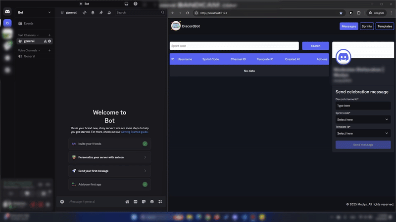

# DiscordBot

DiscordBot is an application that automates the process of sending congratulatory messages to a Discord channel, celebrating user achievements such as completing a sprint or reaching a milestone.

## Main features

**Messages**:

- Allows viewing the data of congratulatory messages sent to a Discord channel.

**Send Message**:

- Allows sends celebratory messages to a specified Discord channel with a randomly selected GIF and a customizable message template.

**Sprints Management**:

- Allows customization and management sprint codes and sprint names.

**Templates Management**:

- Allows customization an management message templates.

## Quick Tour of the DiscordBot



## Installation

**Clone the Repository**:

- https://github.com/Mikolonija/discordBot.git

## Requirements

**Visual studio code**

- Recommended code editor for development.

**Node v22.13.0**

- Required to running the application.

## Running the backend

1. **Navigate to the backend directory:**

- `Open your terminal and move to the backend folder:`

  ```sh
  cd backend
  ```

2. **Install dependencies:**

- `Run the following command to install all required packages`

  ```sh
  npm install
  ```

3. **Create .env file:**

- `Create a .env file in the root of the backend directory with the following environment variables:`
- `More info how get .env values read (## Instruction how setup .env values)`

  ```sh
  DISCORD_BOT_TOKEN=
  DISCORD_USER_ID=
  DISCORD_SERVER_ID=
  GIPHY_API_KEY=
  DATABASE_URL=
  ```

4. **Migrate the Database**

- `Apply the latest database migrations:`

  ```sh
  npm run migrate:latest
  ```

5. **Start the server:**

- `Run the following command:`

  ```sh
  npm run start
  ```

## Instruction how setup .env values

**1.1 DISCORD_BOT_TOKEN**:

- Go to the https://discord.com/developers/applications.
- Create a new application or select an existing one.
- Navigate to the "Bot" section.
- Under "Token", click "Reset Token" and copy it.
- Paste the token into your .env .

**1.2 Setup Gateway Intents**:

- "Bot" section scroll down to the Privileged Gateway Intents section.
- Enable Presence Intent
- Enable Server Members Intent
- Enable Message Content Intent should on

**1.3 Authenticate the Bot (OAuth2 Setup)**:

- Navigate to the "OAuth2" section.
- Find section "OAuth2 URL Generator"
- Under Scopes, select bot.
- Under Bot Permissions, choose Administrator
- Copy the generated URL and open it in your browser.
- Select the server where you want to add the bot and click "Authorize".

**1.4 DISCORD_USER_ID**:

- In Discord, go to User Settings → Advanced → Enable Developer Mode
- Navigate to the server where your bot is installed.
- Open the member list (On the right side of the screen).
- Right-click on your username and select "Copy User ID".
- Paste the token into your .env .

**1.5 DISCORD_SERVER_ID**:

- Right-click on the server name (left sidebar) where your bot is installed.
- Click "Copy Server ID".
- Paste the token into your .env .

**1.6 GIPHY_API_KEY**:

- Go to the https://developers.giphy.com/docs/api/endpoint/.
- Sign in or create a GIPHY developer account.
- Click “Create an API Key” to generate your key.
- Select “API Selected”.
- Enter an App Name (e.g., “MyApp”).
- Choose "Web" for Platform Type.
- Paste the token into your .env .

**1.7 DATABASE_URL**:

- Decide where you want to store your SQLite database file.
- For example: ./data/database.db
- Paste the full path into your .env file.

## Running the frontend

1. **Navigate to the frontend directory:**

- `Open your terminal and move to the frontend folder:`

  ```sh
  cd frontend
  ```

2. **Install dependencies:**

- `Run the following command to install all required packages`

  ```sh
  npm install
  ```

3. **Start the development server:**

- `Run the following command:`

  ```sh
  npm run dev
  ```

4. **Open in the browser:**

- `Click the link provided in the terminal to view the project.`

## Backend

- `Navigate to the backend directory`

#### Format code in backend

- `Run the following command:`

  ```sh
  npm run format
  ```

#### Run test in backend

- `Run the following command:`

  ```sh
  npm run test
  ```

#### Libraries Used:

- **better-sqlite3**
- **discord.js**
- **dotenv**
- **express**
- **kysely**
- **prettier**
- **supertest**
- **typescript**
- **vitest**
- **helmet**

## Description of folders and files from backend

### `src/`

- `app.ts`: Configures express app with routes and middleware.
- `config.ts`: Stores app configuration.
- `index.ts`: Initializes the app, connects to the database, and starts the server.

### `src/database`

- `migrations`: Contains database migration files to create the database schema.
- `index.ts`: Connects to the SQLite database using Kysely.
- `migrate.ts`: Runs database migrations to ensure the schema is up-to-date with the latest version.
- `types.ts`: Defines TypeScript types for the database tables.

### `src/middleware`

- `errorHandler.ts`: Handles errors and sends JSON response with error message and status.

### `src/modules`

- `messages`: Manages messages, including repository, controller, service, router, and types for message data handling.
- `profile`: Manages user profiles, including controller, router, and types for user data handling.
- `sprints`: Manages sprints, including controller, repository, router, and types for sprint data handling.
- `templates`: Manages templates, including controller, repository, router, and types for template data handling.

### `src/services`

- `discord.ts`: Manages Discord bot interactions, including sending messages and checking usernames.
- `giphy.ts`: Fetches a random GIF from the Giphy API.

### `src/utils`

- `createError.ts`: Utility to create error objects with a custom message and status code.
- `createSuccess.ts`: Utility to create success response objects with a message and optional data.

#### `/tests`

- `*`: Contains tests for API endpoints.

### `/`

- `.env`: Environment variables.
- `.gitignore`: Specifies files and directories to ignore in Git.
- `.prettierrc`: Configuration file for code format.
- `package-lock.json`: Locks the exact versions of project dependencies to ensure consistent installations across environments.
- `package.json`: Manages project metadata, dependencies, and scripts used in the project.
- `tsconfig.json`: The typeScript configuration file.
- `vitest.config.ts`: Configuration file for vitest.

## Frontend

- `Navigate to the frontend directory`

#### Format code

- `Run the following command:`

  ```sh
  npm run format
  ```

#### Run unit test

- `Run the following command:`

  ```sh
  npm run test:unit
  ```

#### Run E2E test

- `Run the following command:`

  ```sh
  npm run test:e2e
  ```

#### Libraries Used:

- **react**
- **react-dom**
- **axios**
- **cypress**
- **prettier**
- **vite**
- **react-router-dom**
- **react-toastify**
- **typescript**
- **jsdom**
- **styled-components**
- **vite-plugin-compression2**

## Description of folders and files from frontend

### `/public`

- `logo.svg`: The project logo.

#### `/cypress`

- `e2e`: Contains end-to-end tests.
- `support`: Holds configurations for Cypress tests.

### `src/`

- `config.ts`: Stores application configuration values.
- `global.d.ts`: Global definitions.
- `index.ts`: Application initialization and mounting file.

#### `src/assets/`

- `*`: Project images.

#### `src/components/`

- `DropDown`: Reusable dropdown component.
- `Footer`: Application footer section.
- `Header`: Top navigation/header section.
- `Layout`: Base layout wrapper for pages.
- `Modal`: Modal (popup) component.
- `ProfileCard`: Displays user profile information in card format.
- `Table`: Reusable table component

#### `src/hooks/`

- `useFetch.test.ts`: Unit tests for the useFetch hook.
- `useFetch.ts`: Custom hook for fetching data from APIs.
- `useMediaQuery.ts`: Hook to detect screen size changes based on media queries.
- `useOutsideClickAndEscape.ts`:Hook that detects clicks outside an element and Escape key presses.

#### `src/pages`

- `Messages`: Page displaying profile and messages table.
- `NotFound`: Page displaying 404 page then a route is not found.
- `Sprints`: Page for managing and viewing sprints.
- `Templates`: Page for managing and viewing templates.
- `index.tsx`: Entry point for routing pages.

#### `src/router`

- `routes.tsx`: Defines application routes

#### `src/styles`

- `*`: Contains global styles shared across the application (e.g., variables, resets, base styles).

#### `src/tests`

- `setup.ts`: Configures the testing environment for Vitest.

#### `src/utils`

- `helpers.test.ts`: Unit tests for utility/helper functions.
- `helpers.ts`: Contains reusable utility functions used across the app.

#### `src/utils/types/enums`

- `*`: Enums for consistent value usage across the app.

#### `src/utils/types/interfaces`

- `*`: Interfaces for data structures.

#### `src/utils/types/media`

- `*`: Uses the sizes from breakpoints.ts to define responsive media queries, making it easier to implement responsive design in the application.

### `/`

- `.gitignore`: Specifies files and directories to ignore in Git.
- `.prettierrc`: Configuration file for code format.
- `index.html`: The main HTML file that serves as the entry point for the web app.
- `package-lock.json`: Locks the exact versions of project dependencies to ensure consistent installations across environments.
- `package.json`: Manages project metadata, dependencies, and scripts used in the project.
- `tsconfig.app.json`: TypeScript configuration for the app.
- `tsconfig.json`: The main TypeScript configuration file.
- `tsconfig.node.json`: TypeScript configuration for Node.js.
- `vite.config.ts`: Configuration file for Vite.
